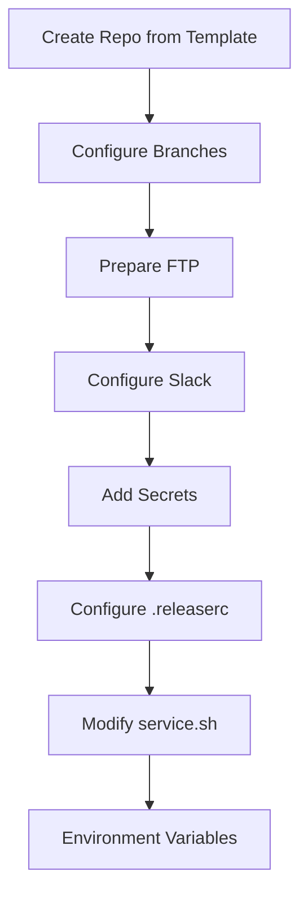
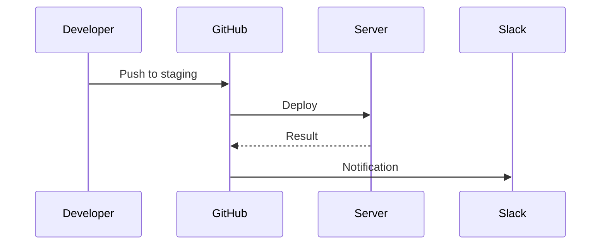

# CI/CD Template Configuration Guide

## System Overview


## Configuration Steps

### 1. Create new repository from template
1. Go to the template page on GitHub
2. Click on "Use this template"
3. Select name and configuration for the new repository

### 2. Configure Branches
```bash
git checkout staging
git branch main staging -f
git checkout main
git push origin main -f
```

### 3. Prepare Server Directories
Create these directories on your server:
- Staging: `/var/www/staging`
- Production: `/var/www/production`

### 4. Create FTP Accounts
Create separate FTP accounts for each environment with write permissions in their respective directories.

### 5. Slack Configuration
1. Create new Slack channel for the project
2. Add the CI/CD bot to the channel
3. Configure incoming webhook

### 6. GitHub Secrets Configuration
Add these secrets in GitHub (Settings > Secrets):
```
SLACK_WEBHOOK_URL - Slack webhook URL
STAGING_FTP_USERNAME - FTP username for staging
STAGING_FTP_PASSWORD - FTP password for staging  
STAGING_FTP_SERVER - FTP server for staging
PRODUCTION_FTP_USERNAME - FTP username for production
PRODUCTION_FTP_PASSWORD - FTP password for production
PRODUCTION_FTP_SERVER - FTP server for production
```

### 7. Configure .releaserc
Edit `.releaserc` file:
```json
{
  "repositoryUrl": "https://github.com/your-org/your-repo"
}
```

### 8. Configure service.sh
Edit `.github/workflows/service.sh` with project data:
```bash
export SERVICE_NAME="Project Name"
export SERVICE_TYPE="frontend" # or "backend"
export DEV_SERVICE_URL="https://staging.domain.com"
export PROD_SERVICE_URL="https://domain.com"
```

### 9. Environment Variables (Optional)
For projects that need variables in the build, create a repository variable called `ENV_CONFIG` with format:
```
# STAGING
VITE_API_URL=https://api.staging.com
VITE_ANALYTICS_ID=UA-123456

# PRODUCTION  
VITE_API_URL=https://api.production.com
VITE_ANALYTICS_ID=UA-654321
```

## Workflow Diagram

