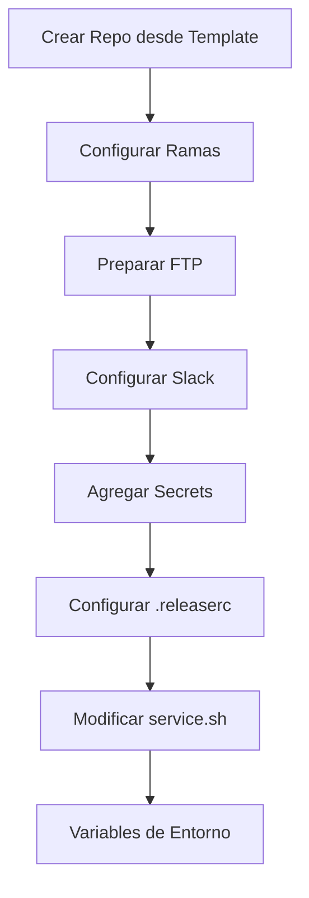
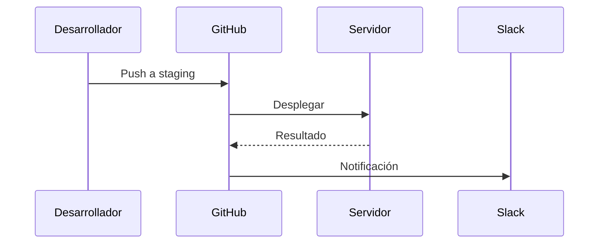

# Guía de Configuración del Template CI/CD

## Visión General del Sistema


## Pasos de Configuración

### 1. Crear nuevo repositorio desde template
1. Ir a la página del template en GitHub
2. Hacer clic en "Use this template"
3. Seleccionar nombre y configuración para el nuevo repositorio

### 2. Configurar Ramas
```bash
git checkout staging
git branch main staging -f
git checkout main
git push origin main -f
```

### 3. Preparar Directorios en el Servidor
Crear estos directorios en tu servidor:
- Staging: `/var/www/staging`
- Producción: `/var/www/production`

### 4. Crear Cuentas FTP
Crear cuentas FTP separadas para cada entorno con permisos de escritura en sus respectivos directorios.

### 5. Configuración de Slack
1. Crear nuevo canal de Slack para el proyecto
2. Agregar el bot de CI/CD al canal
3. Configurar webhook entrante

### 6. Configuración de Secrets en GitHub
Agregar estos secrets en GitHub (Settings > Secrets):
```
SLACK_WEBHOOK_URL - URL del webhook de Slack
STAGING_FTP_USERNAME - Usuario FTP para staging
STAGING_FTP_PASSWORD - Contraseña FTP para staging  
STAGING_FTP_SERVER - Servidor FTP para staging
PRODUCTION_FTP_USERNAME - Usuario FTP para producción
PRODUCTION_FTP_PASSWORD - Contraseña FTP para producción
PRODUCTION_FTP_SERVER - Servidor FTP para producción
```

### 7. Configurar .releaserc
Editar archivo `.releaserc`:
```json
{
  "repositoryUrl": "https://github.com/tu-org/tu-repo"
}
```

### 8. Configurar service.sh
Editar `.github/workflows/service.sh` con los datos del proyecto:
```bash
export SERVICE_NAME="Nombre del Proyecto"
export SERVICE_TYPE="frontend" # o "backend"
export DEV_SERVICE_URL="https://staging.dominio.com"
export PROD_SERVICE_URL="https://dominio.com"
```

### 9. Variables de Entorno (Opcional)
Para proyectos que necesiten variables en el build, crear una variable de repositorio llamada `ENV_CONFIG` con formato:
```
# STAGING
VITE_API_URL=https://api.staging.com
VITE_ANALYTICS_ID=UA-123456

# PRODUCTION  
VITE_API_URL=https://api.production.com
VITE_ANALYTICS_ID=UA-654321
```

## Diagrama del Flujo de Trabajo
